# What is a GPU?

In high-performance computing, a GPU is used as an accelerator or a piece of auxiliary hardware that is used in tandem with a CPU to quickly carry out numerically-intensive operations.

The main line of execution runs on the CPU. At times, work is offloaded to the GPU. The diagram and pseudocode below present a simplified example of this:

As shown in the figure above, the code is executed by the CPU. After the file is read, the data is transferred from CPU memory to GPU memory. The `matrix_inverse` kernel is carried out on the GPU. The output is then copied from GPU memory to CPU memory. Lastly, the result is written to a file. Note that this is a highly simplified view of how things work.

The table below presents the key differences between a CPU and a GPU:

|                      | **CPU**                      |  **GPU**       |
|:--------------------:|:------------------------:|:----------:|
|**cores**                 |          O(10)           |    O(1000) | 
|**clock speed**           |          2-3 GHz         |    1 GHz   |
| **memory size**          |          100-1000 GB     |   16-80 GB |
| **memory bandwidth**          |     50-100 GB/s     |   800-1600 GB/s |
| **L1 cache size**           |          large           |   small    |
| **control logic** |  performs well  | performs poorly |
| **model**| task parallelism |SIMT|

The schematic diagram below shows an example distribution of chip resources for a CPU versus a GPU:

An example of control logic would be an "if" statement. SIMT is single instruction, multiple threads. This is where each thread performs the same operation on different data. Multicore CPUs can perform very different tasks on different cores simultaneously. The cores on a GPU must all perform the same operation on the scale of a warp, which is a group of threads.

# AMD GPUs for HPC

The GPU landscape will change in 2022. While NVIDIA has been the only HPC vendor for years, AMD and Intel will enter the race. The [Frontier supercomputer](https://en.wikipedia.org/wiki/Frontier_(supercomputer)), which will come online in 2022, will be the first exascale machine in the US. It will feature the AMD MI250X GPU with AMD CPUs. The MI250X is equal to or more powerful than the A100 by every measure. In general, the speed-up is 1.5x to 2x for FP64 and 3x for FP32. The memory bandwidth in the MI250x is superior to that in the A100.

AMD will also produce the MI250, which can be used with AMD or Intel CPUs, and the MI210 which is a more general-purpose GPU.

Princeton has one [AMD MI100 GPU](https://www.amd.com/en/products/server-accelerators/instinct-mi100) which is [available for testing](https://researchcomputing.princeton.edu/amd-mi100-gpu-testing). The MI100 has a performance that is in between the V100 and A100.

# Intel GPUs for HPC

The [Aurora supercomputer](https://en.wikipedia.org/wiki/Aurora_(supercomputer)) will come online in 2022. It will have a peak performance of 1 exaflops. Aurora will feature the Intel Xe "Ponte Vecchio" GPU.

All the available "Ponte Vecchio" GPUs are going to build Aurora. Princeton will secure one for testing in 2022.

# NVIDIA GPUs for HPC

| GPU                  | FP64 Cores |  FP64 Performance (FLOPS) | Memory (GB) | Year Released |
|:--------------------:|:------------------------:|:----------:|:--------:|:----------:|
|  [NVIDIA P100](https://www.nvidia.com/en-us/data-center/tesla-p100/)   | 3584 | 4.7                      |  16              | 2016 |
|  [NVIDIA V100](https://www.nvidia.com/en-us/data-center/v100/)         | 5120 | 7.0                      |  32              | 2017 |
|  [NVIDIA A100](https://www.nvidia.com/en-us/data-center/a100/)         | 6912 | 9.7                      |  40 or 80        | 2020 |

# NVIDIA A100

The NVIDIA A100 was released in 2020. The slides below are taken from the [GTC 2020 keynote talk](https://www.youtube.com/watch?v=onbnb_D1wC8&t=179s) and [this talk](https://www.youtube.com/watch?v=NXSsZTGNqzk).

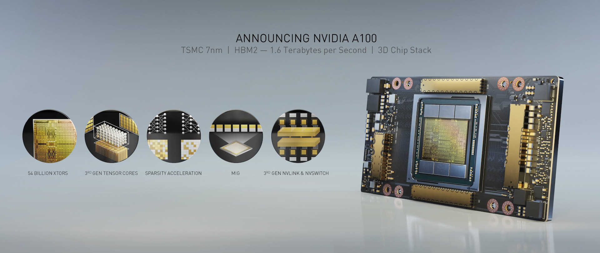
  
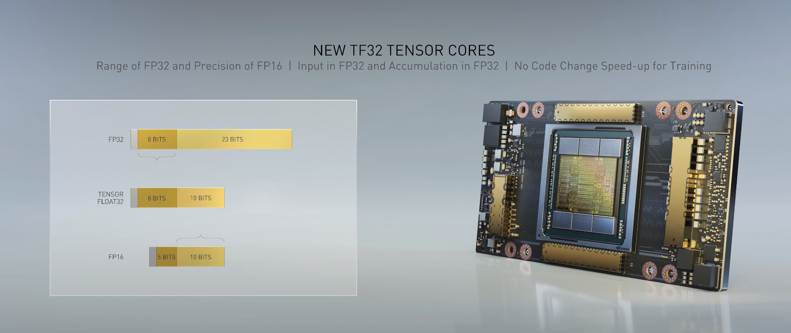
  
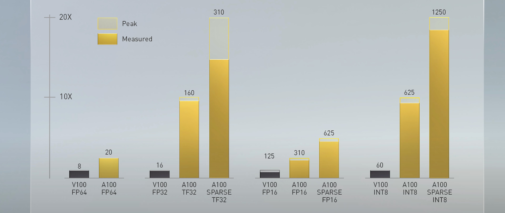
  
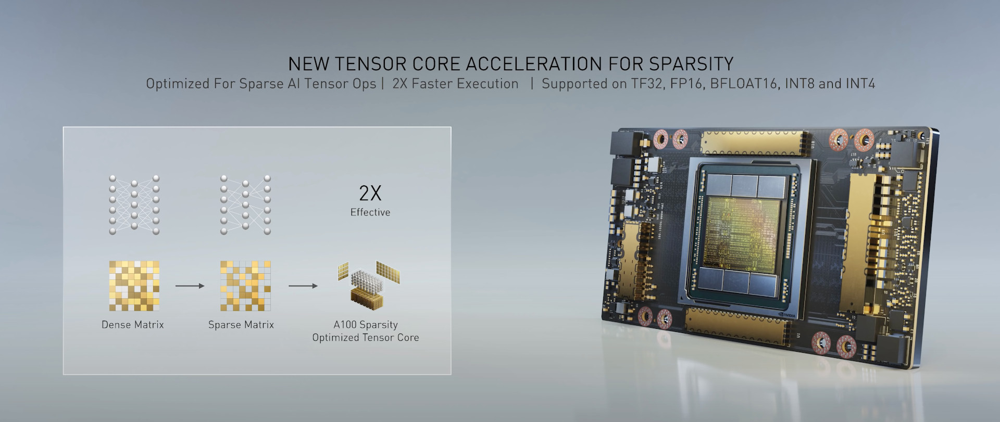
  
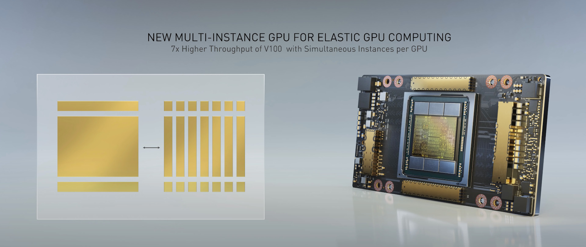
  
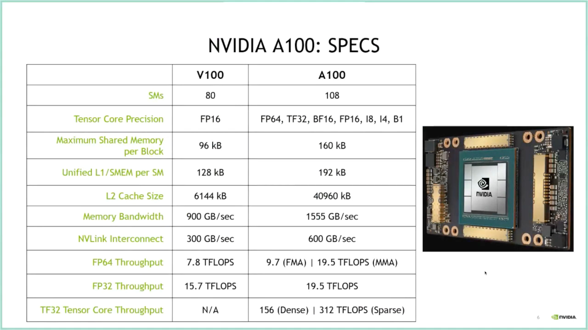

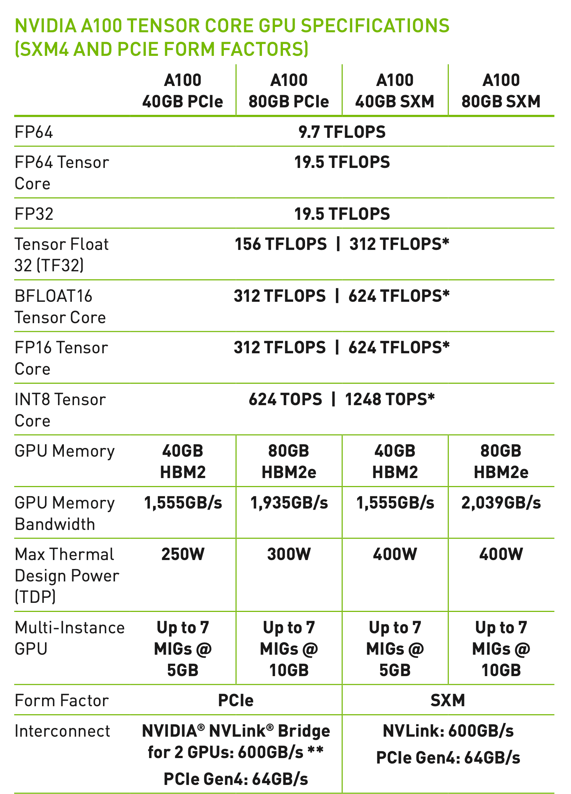

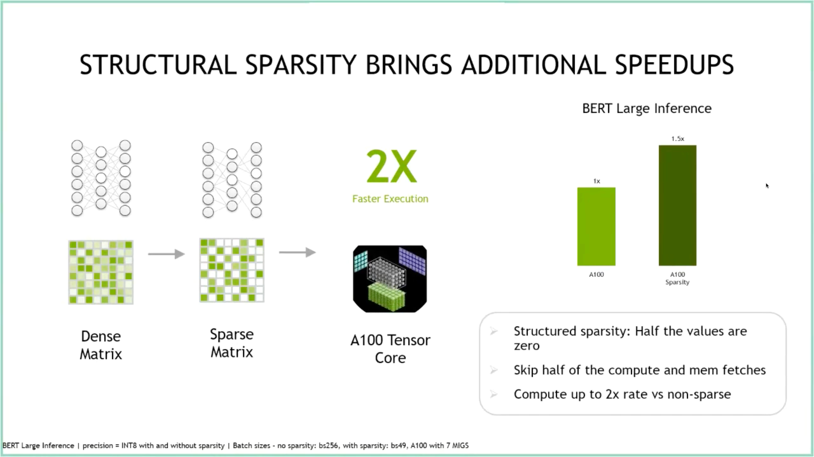

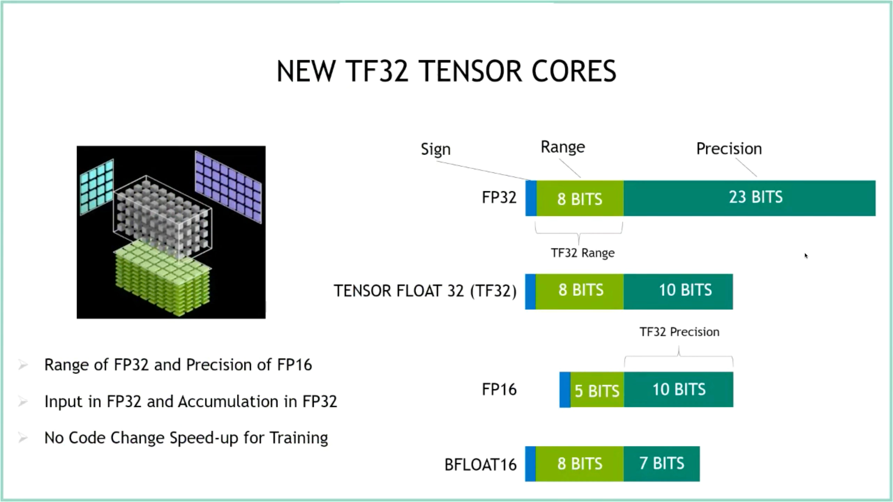

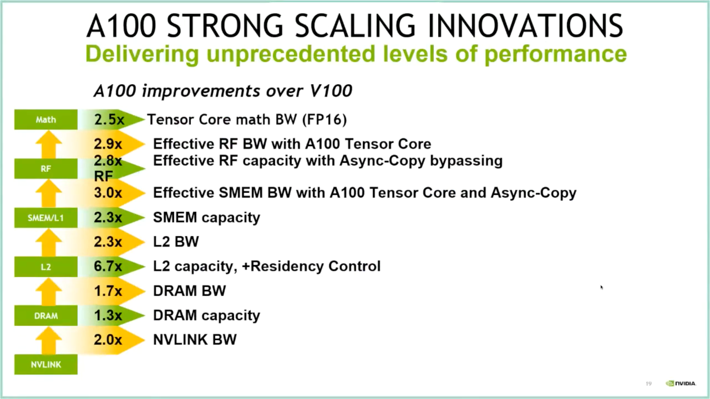

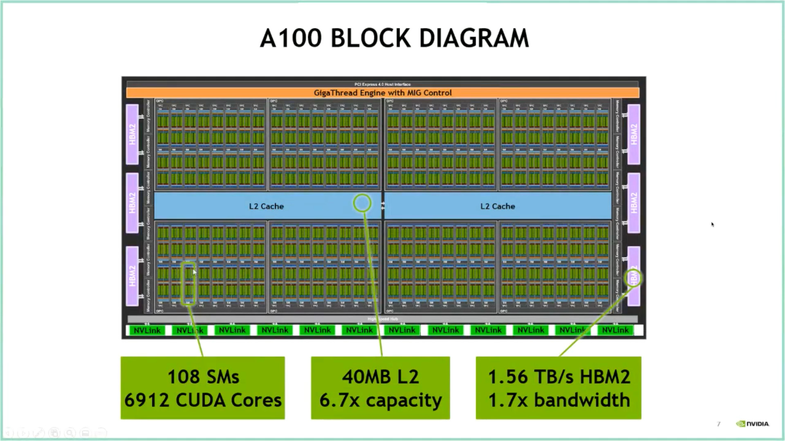

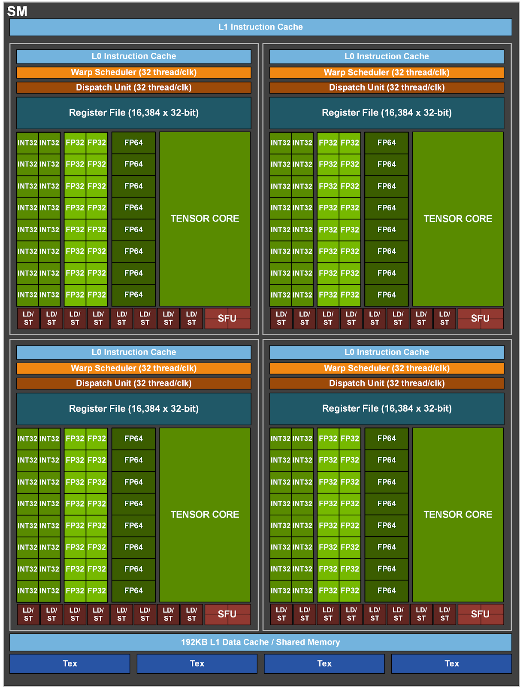

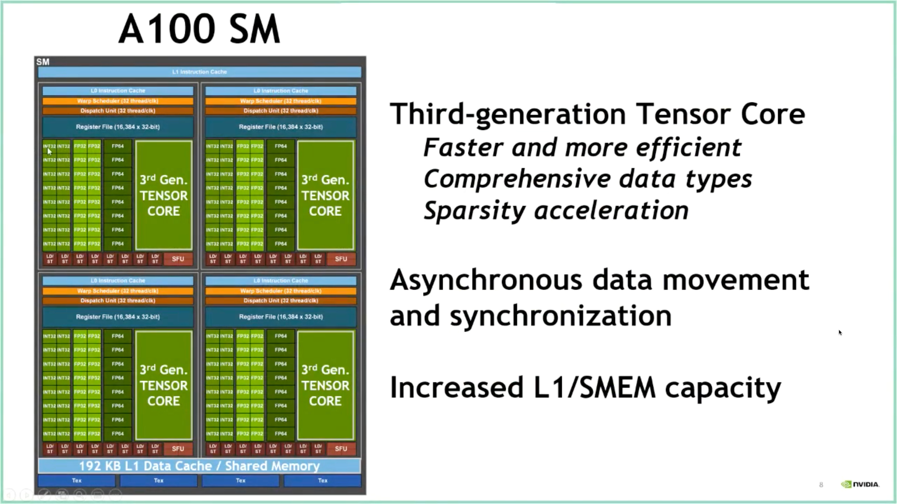

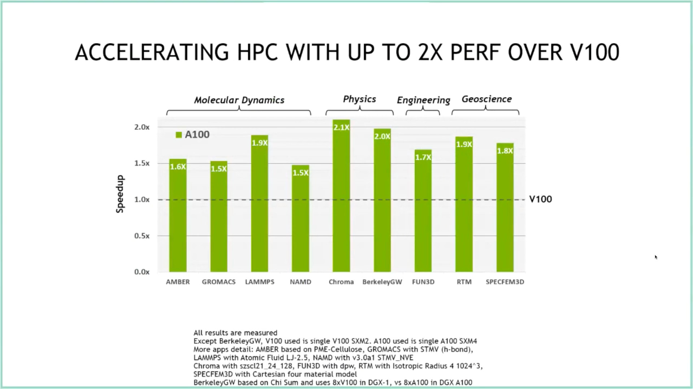

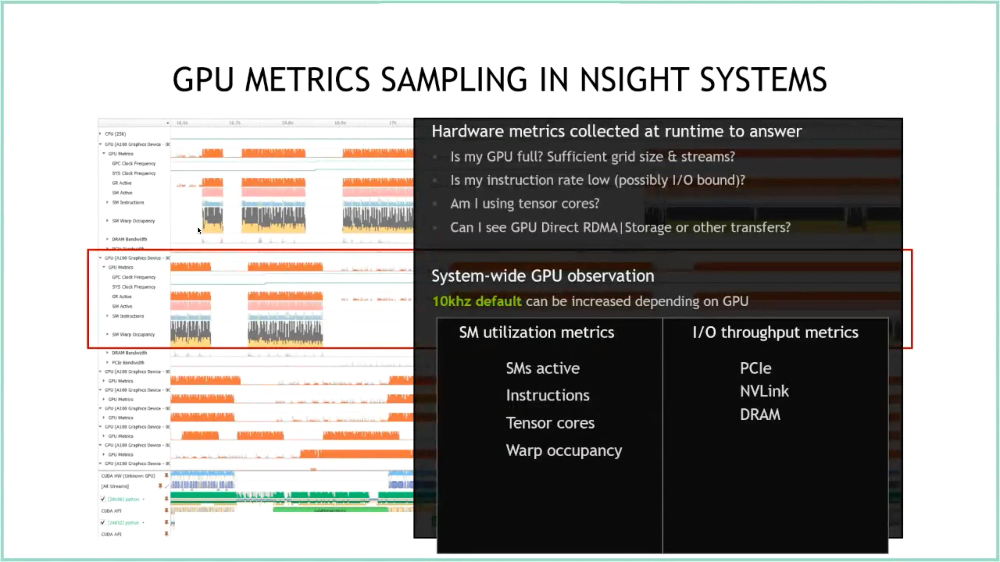

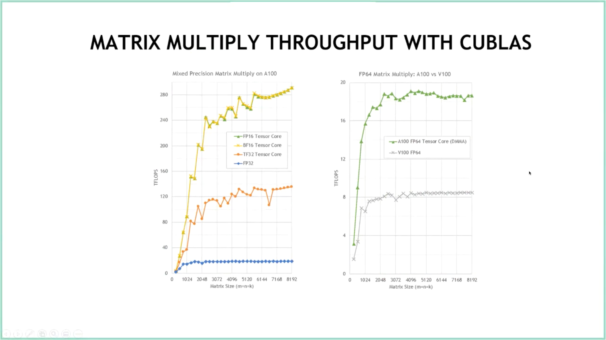  

# NVIDIA CUDA Toolkit 11 and cuDNN 8
  
The [CUDA Toolkit 11](https://developer.nvidia.com/cuda-toolkit) was developed specifically for the A100 GPU. It is composed of GPU libraries and tools. Software must use the CUDA Toolkit 11 in order to fully leverage all of the features of the A100 GPU. Some software that is built against the CUDA Toolkit 10.x will not use the A100 at all.

